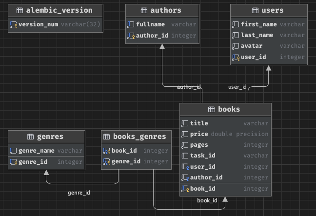

# Документация к тестовому проекту book-catalog

---
Для запуска проекта:
---
docker-compose -f docker/docker-compose.yaml up -d

---
Для наката тестовых данных после запуска:
---
python3 src/create_test_data.py 

---
Схема базы данных:
---

**Для удобства тестирования выставляемые дни на бронь (days) соответствуют минутам реального времени
